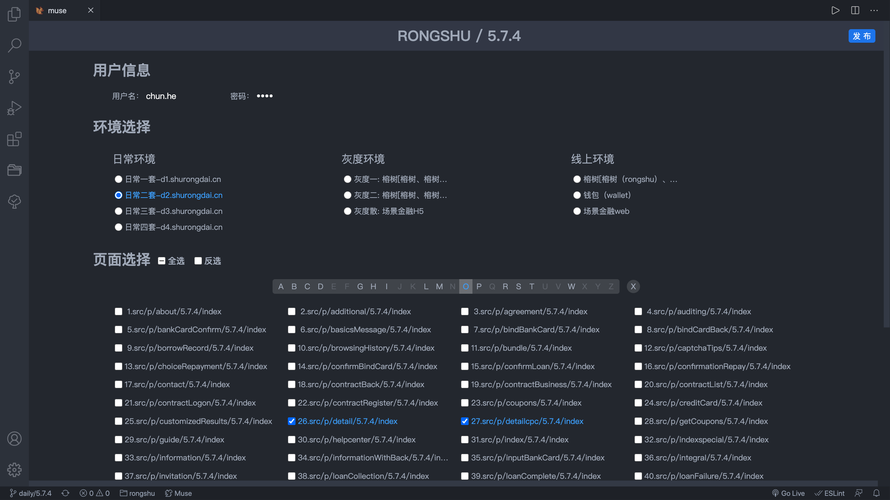

# Muse publish tool

`muse` 工具是用于 `bid` 所构建项目的发布工具，区别于 `bid` 的命令行模式， `muse` 基于 `vscode` 扩展提供了 `GUI` 操作界面，更加简单高效，告别了繁琐的输入选择发布的繁琐流程，让代码发布变得`human friendly`

## 使用工具发布

#### screenshot

---



## 打包安装

```shell
npm i -g vsce

vsce package

code --install-extension xxx.vsix
```

vscode 插件安装方式有很多，最主要的是通过插件市场安装，但是本插件因为涉及到内部服务器的域名和一些其它不宜工具的信息，所以不发布到应用市场，所以采用离线安装

- 离线安装

  - 在应用商店中点击更多菜单，选择`install from vsix`然后选择安装的`vsix`程序

  - 在 `vscode` 资源管理器中，右键 `vsix` 文件，选择`安装扩展vsix`
